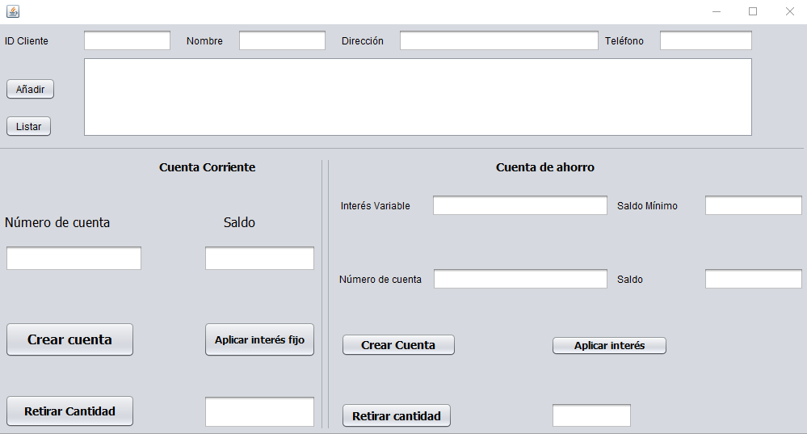

# GestionCuentaAhorro
Gestión de cuenta de ahorro con Java, utilizando estructuras de datos de tipo array para almacenar la información.

### Este proyecto está creado con ArrayList y utilizando herencias

